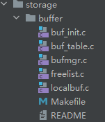

## 共享缓冲区基础知识
通常数据库系统都会在内存中预留buffer缓冲空间用于提升读写效率，因为与内存读写交互效率远大于与磁盘的读写效率，而缓冲区管理器管理着缓冲区内存空间，将热数据加载到内存中以减少直接的磁盘读写，并维持这部分数据在缓冲池中的状态/锁管理,充当着读写进程和操作系统之间的协同者角色；  
共享缓冲区管理器在设计上需要考虑的核心问题是：缓冲区大小设计+提升缓冲区命中率+制定合理缓冲区回收策略+保证多并发下的一致性问题。  
在开始需要先了解一些基础知识。
### 逻辑读和物理读
逻辑读和物理读的区别在pg后台进程获取数据的过程中是否涉及到磁盘读，逻辑读过程中pg后台进程直接读从共享缓冲区获取到的数据页，物理读需要从借助操作系统从磁盘读取数据并加载到内存中再返回给读写程序。  
做个实验先创建表并插入数据，通过expain analyze分析看一下物理读和逻辑读的差异。
```sql
postgres=# create table yzg(a int ,b varchar);
postgres=# insert into yzg (1,'a');
postgres=# insert into yzg select * from yzg;
INSERT 0 1
...
postgres=# insert into yzg select * from yzg;
INSERT 0 524288
```
构造查询语句SELECT * FROM yzg,发现命中了缓冲池中的4640个页（这里的yzg整个表大小也是4640个页，因为新建的pg环境没有其他并行连接和查询），这里就是逻辑读的过程；
```sql
postgres=# EXPLAIN (ANALYZE, BUFFERS) SELECT * FROM yzg;
                                                  QUERY PLAN
---------------------------------------------------------------------------------------------------------------
 Seq Scan on yzg  (cost=0.00..15125.76 rows=1048576 width=6) (actual time=0.015..140.675 rows=1048576 loops=1)
   Buffers: shared hit=4640
 Planning Time: 0.051 ms
 Execution Time: 222.198 ms
(4 rows)

postgres=# SELECT
postgres-#     nspname AS schema_name,
postgres-#     relname AS table_name,
postgres-#     pg_total_relation_size(C.oid) AS total_size, -- 包括表、索引、toast表等的总大小
postgres-#     pg_relation_size(C.oid) AS heap_size,       -- 表的堆大小
postgres-#     (pg_relation_size(C.oid) / (1024 * 8))::bigint AS pages -- 表占用的页面数（假设页面大小为8KB）
postgres-# FROM g_class C LEFT JOIN pg_namespace N ON (N.oid = C.relnamespace) WHERE nspname || '.' || relname = 'public.yzg';
 schema_name | table_name | total_size | heap_size | pages
-------------+------------+------------+-----------+-------
 public      | yzg        |   38060032 |  38010880 |  4640
(1 row)

```
如果我们把数据库down掉后再启动数据库，缓冲区数据就会被清理，再看执行计划产生了物理读；
```sql

postgres=# EXPLAIN (ANALYZE, BUFFERS) SELECT * FROM yzg;
                                                  QUERY PLAN
---------------------------------------------------------------------------------------------------------------
 Seq Scan on yzg  (cost=0.00..15125.76 rows=1048576 width=6) (actual time=0.032..161.956 rows=1048576 loops=1)
   Buffers: shared read=4640
 Planning:
   Buffers: shared hit=15 read=8
 Planning Time: 2.666 ms
 Execution Time: 243.906 ms
(6 rows)

```
### LRU算法和CLOCK时钟算法
将磁盘数据页block加载到内存以提升查询效率的必要性已经不言而喻了，但是通常内存肯定没有磁盘空间充足，其能够缓存的数据空间有限，需要一定策略来决定当内存满时应该替换掉哪些页面，也就是缓存置换算法。  
LRU(Least Recently Used)算法是一种常用的决定当内存满时应该替换掉哪个页面的置换算法，其核心思想是优先淘汰最近最少使用的页面，假设如果一个页面最近被访问过那么它很可能很快会被再次访问，反之如果一个页面很久没被访问那么它很可能在未来也不会被访问。  
CLOCK时钟算法是另一种在数据库缓冲池中使用的更节省资源的LRU替代方案，它试图在访问历史和内存中维持一个平衡，其再内存页面上维护一个“引用位”（reference bit）来判断页面是否最近被访问过，不需要维护完整的访问历史链表，而是通过简单的位标志来判断页面的使用情况，在实现上更加简单消耗的资源也更少但可能不如 LRU 算法精确。  
两者都是缓存置换算法，但CLOCK算法在实现上更简单，并且可以减少内存访问次数，但LRU算法在实现上更复杂，pg使用时钟算法，oracle使用LRU算法。
## 共享缓冲区管理器结构
共享内存缓冲区可以被数据库多个子进程共享访问，缓冲区管理器维护着这块缓冲区的数据一致性并返回真实的数据页page，按照《PostgreSQL指南》将缓冲区管理器分三层：缓冲表、缓冲区描述符、缓冲页，但这里的层次划分是为了便于理解而进行的逻辑划分，如下图。  
  
在代码上共享内存缓冲区的目录地址是src/backend/storage/buffer/,总代码量6000行+，其中：  
1.buf_init.c 是缓冲区管理器的初始化入口，在启动数据库进程时候会初始化并分配1个共享内存缓冲区，并初始化缓冲表、缓冲区描述符和缓冲页。  
2.buf_table.c 是缓冲表管理器，维护着缓冲区管理器中缓冲区的索引，缓冲区管理器通过缓冲表获取缓冲区描述符的索引项。  
3.bufmgr.c 是缓冲区管理器核心代码，处理缓冲区管理器中缓冲区的访问并返回真实的数据页page。  
4.freelist.c 是缓冲区管理器中缓冲区的淘汰策略，缓冲区不够用时调用淘汰策略来淘汰缓冲区。  
5.localbuf.c 是本地缓冲区管理器，用于管理本地缓冲区，本地缓冲区是进程私有的缓冲区，用于缓存进程自己访问的数据.  

### 共享缓冲表层
共享缓冲表层代码实现在buf_table.c文件中，其函数都是针对hash表（dynahash.c）的查/增/删操作,这个hash表是全局共享的在InitBufferPool()中创建。  
  
其中BufTableHashCode函数将在hash表中找到入参buffer_tags对应的buffer_id：
```c
uint32 BufTableHashCode(BufferTag *tagPtr)
{
	return get_hash_value(SharedBufHash, (void *) tagPtr);
}
```
buffer_tag数据库子进程对于共享缓冲区的输入，能够唯一标识请求的page页，其中RelFileNode的属性分别是表对象oid/数据块oid/表空间oid，页面的forknumber（分别为0、1、2）（0=表和索引块，1=fsm，2=vm）页面number（页面属于哪个块）。例如{(16888, 16389, 39920), 0, 8}标签表示在某个表空间（oid=16888）某个数据库（oid=16389)的某表（oid=39920）的0号分支（ 0代表关系表本体）的第8号页面。
```c
// 映射关系
typedef struct
{
	BufferTag	key;			/* Tag of a disk page */
	int			id;				/* Associated buffer ID */
} BufferLookupEnt;  
// BufferTag结构定义在buf_internals.h中，可以唯一标识数据页
typedef struct buftag
{
	RelFileNode rnode;			/* physical relation identifier */
	ForkNumber	forkNum;
	BlockNumber blockNum;		/* blknum relative to begin of reln */
} BufferTag;
// 关系定义包含表空间id+dbid+表id
typedef struct RelFileNode
{
	Oid			spcNode;		/* tablespace */
	Oid			dbNode;			/* database */
	Oid			relNode;		/* relation */
} RelFileNode;
```
### 共享缓冲区描述符层
共享缓冲区描述符层也维护了1个BufferDesc元素构成的BufferDescriptors数组，该数组是所有数据库进程共享的，数组创建后由BufferStrategyControl负责管理，每个BufferDesc包含BufferTag和buf_id信息以及freeNext。  
  
其中有个概念是freelist数组用于缓存空闲的BufferDesc，是BufferDescriptors数组中某些描述符的引用，当缓冲池管理器需要一个空闲的缓冲区时会首先检查freelist并从中取出空闲缓冲区的引用，这个描述符将从freelist中移除并被标记为已分配状态，当一个缓冲区不再需要时它的描述符会被放回freelist中。
### 共享缓冲页层
共享缓冲页层即buffers[]数组，存储真实的数据页page，并与共享描述符一一对应。
## 共享缓冲区管理器工作流程

### 初始化缓冲区
shared_buffers参数是基于系统内存大小动态计算的,对于<8GB内存的系统默认值为 128MB，对于>8GB,<16GB内存的系统默认值为系统内存的 1/4，对于>16GB内存的系统默认值为 4GB。
```sql
postgres=# show shared_buffers ;
 shared_buffers
----------------
 128MB
```
初始化流程如下：
```c
main(int argc, char *argv[])
--> PostmasterMain(argc, argv);
    --> reset_shared();     // Set up shared memory and semaphores.
        --> CreateSharedMemoryAndSemaphores(); // Creates and initializes shared memory and semaphores.
            --> CalculateShmemSize(&numSemas); // Calculates the amount of shared memory and number of semaphores needed.
                --> add_size(size, BufferShmemSize());
            --> PGSharedMemoryCreate(size, &shim);
            --> InitShmemAccess(seghdr);
            --> InitBufferPool();  // 初始化缓冲池
                // 1. 初始化buffer descriptor
                --> ShmemInitStruct("Buffer Descriptors",NBuffers * sizeof(BufferDescPadded),&foundDescs);  
                // 2. 初始化buffer pool
                --> ShmemInitStruct("Buffer Blocks", NBuffers * (Size) BLCKSZ, &foundBufs);
                --> StrategyInitialize(!foundDescs);   
                // 3. 初始化 buffer table
                    --> InitBufTable(NBuffers + NUM_BUFFER_PARTITIONS);
                        --> ShmemInitHash("Shared Buffer Lookup Table", size, size, &info, HASH_ELEM | HASH_BLOBS | HASH_PARTITION);
                           --> hash_create(name, init_size, infoP, hash_flags);
```
### 读缓冲区
读取缓冲区的流程比较简单，缓冲表根据输入（buftag）输出缓冲区描述符id，然后在缓冲区描述符内查找buf_id，若buf_id值大于0表示命中，命中后pin住该页使之不能被淘汰掉，修改BufferDesc->state值，refcount+1,usage+1，没有命中根据淘汰策略淘汰页再从磁盘读取页到缓冲区槽位，然后根据缓存区槽位返回对应的buf_id。  
  
函数梳理：
```c
Buffer ReadBuffer(Relation reln, BlockNumber blockNum)
--> ReadBufferExtended(reln, MAIN_FORKNUM, blockNum, RBM_NORMAL, NULL);
	--> ReadBuffer_common(RelationGetSmgr(reln), reln->rd_rel->relpersistence,forkNum, blockNum, mode, strategy, &hit);
		--> BufferAlloc(smgr, relpersistence, forkNum, blockNum, strategy, &found);
			--> INIT_BUFFERTAG(newTag, smgr->smgr_rnode.node, forkNum, blockNum); /* create a tag so we can lookup the buffer */
			--> BufTableHashCode(&newTag); // 哈希函数输入buftag，输出哈希值
				--> get_hash_value(SharedBufHash, (void *) tagPtr);
			--> buf_id = BufTableLookup(&newTag, newHash);  // 根据buftag，查找缓冲表，获得bug_id，如果命中的话，如果找不到，返回-1
				--> hash_search_with_hash_value(SharedBufHash,(void *) tagPtr,hashcode,HASH_FIND,NULL);
			// 如果命中，返回，如果没有命中,继续执行
			--> StrategyGetBuffer(strategy, &buf_state);	// 获取一个空闲可用的buffer，返回bufferdesc， 默认策略是NULL
				--> GetBufferFromRing(strategy, buf_state);
			--> BufTableInsert(&newTag, newHash, buf->buf_id); // 将新获取的buf_id,插入到缓冲表中
		--> smgrread(smgr, forkNum, blockNum, (char *) bufBlock); // 从磁盘读到buffer
```
pinbuffer函数用于“pin”一个缓冲区，当缓冲区被pin时意味着它正被一个或多个事务或查询使用，因此不能被缓冲池管理器淘汰或替换：  
  
startBufferIo函数用于启动一个缓冲区I/O操作,当缓冲区中的数据需要从磁盘读取或写入磁盘时StartBufferIO()会被用来发起从磁盘读取数据的 I/O 请求,同样当缓冲区中的数据被修改并且需要持久化到磁盘时也会调用此函数来执行写操作：  

### 淘汰策略
strategygetbuffer函数是缓冲区管理策略的一部分用于获取一个缓冲区，决定从缓冲池中获取哪个缓冲区，如果缓冲区不存在或已被淘汰那么它会根据当前的策略选择一个空闲或可替换的缓冲区，并可能触发 I/O 操作以加载或写入数据。  

### 共享缓冲区锁
待续。


